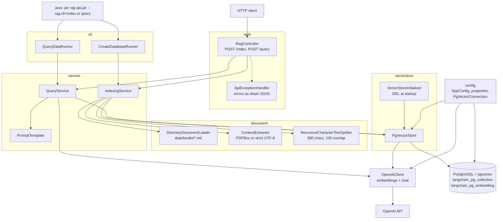
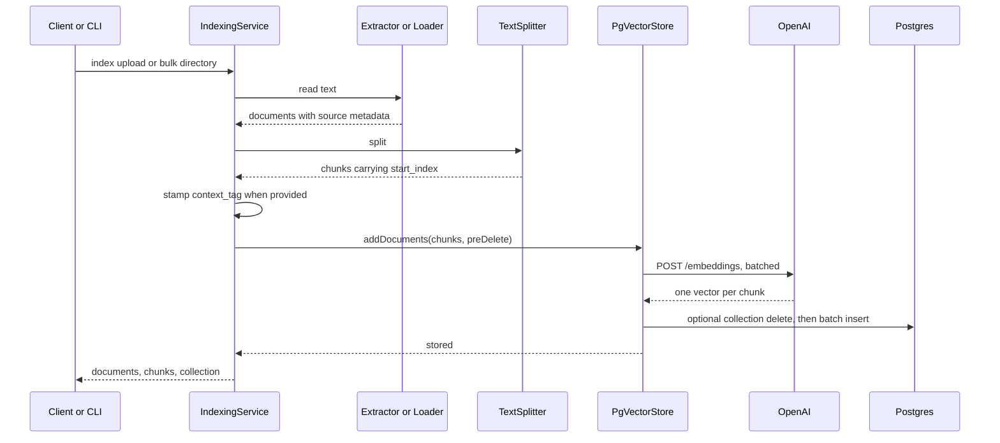
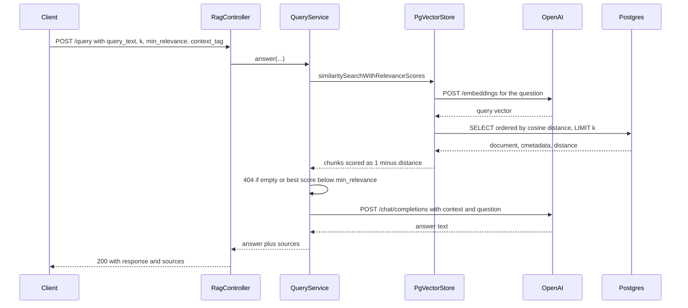

# Architecture

The service answers questions from documents it has indexed. Text is split into chunks, each chunk is
embedded with OpenAI and stored in PostgreSQL with the pgvector extension; a query embeds the question,
retrieves the nearest chunks and asks a chat model to answer from them.

The database layout is the one LangChain's `PGVector` uses (`langchain_pg_collection` and
`langchain_pg_embedding`), so collections written by the earlier Python implementation remain readable.

## Components



There are two entry points into the same services: `RagController` over HTTP, and the `cli` runners for
one-shot commands. `RagApplication` disables the web server when it sees a `--rag.cli=` argument, so the
ingestion and retrieval logic exists in one place regardless of how it is invoked.

`PgVectorStore` is the only class that talks to the database and `OpenAiClient` the only one that leaves
the process for the model. That boundary is what allows the store to be tested against a real Postgres
with a stubbed embedder.

## Ingestion



An upload produces a single document through `ContentExtractor`, which reads PDFs with PDFBox and
otherwise decodes strict UTF-8. The bulk command produces one document per matching file through
`DirectoryDocumentLoader`. Both then share the same splitter and storage path.

Embeddings are computed before the transaction opens, so no database connection is held during the
OpenAI round trip. `reset_collection` (or the bulk command, which always resets) deletes the collection
row first and relies on `ON DELETE CASCADE` to remove its chunks.

## Query



Relevance is reported as `1 - cosine_distance`, matching what LangChain's
`similarity_search_with_relevance_scores` returned, so `min_relevance` thresholds carry over unchanged.
A `context_tag` becomes an equality filter on `cmetadata->>'context_tag'`; the key is inlined into the
SQL (after validation) so the expression index can be used, while the value stays a bound parameter.

## Storage

`VectorStoreInitializer` runs during startup, before the HTTP server accepts traffic, and creates:

```sql
CREATE TABLE langchain_pg_collection (
    uuid      UUID PRIMARY KEY,
    name      VARCHAR NOT NULL UNIQUE,
    cmetadata JSON
);

CREATE TABLE langchain_pg_embedding (
    id            VARCHAR PRIMARY KEY,
    collection_id UUID REFERENCES langchain_pg_collection(uuid) ON DELETE CASCADE,
    embedding     VECTOR,
    document      VARCHAR,
    cmetadata     JSONB
);
```

Plus `CREATE EXTENSION vector`, a GIN index on `cmetadata`, and an expression index on
`cmetadata->>'context_tag'`. Every statement is idempotent, so startup is safe against an existing
database. The `embedding` column is declared without a fixed dimension, which is why changing the
embedding model on an existing collection produces mismatched vectors rather than an error — keep
`OPENAI_EMBEDDING_MODEL` stable once data is indexed.

## Configuration

Settings come from environment variables, resolved in `application.yml` and bound to records in the
`config` package. A `.env` file is imported when present.

- `OPENAI_API_KEY`, and optionally `OPENAI_CHAT_MODEL`, `OPENAI_EMBEDDING_MODEL`, `OPENAI_TEMPERATURE`
- `PGVECTOR_CONNECTION` (accepts `postgresql://` and SQLAlchemy's `postgresql+psycopg://`), or the
  individual `POSTGRES_HOST`, `POSTGRES_PORT`, `POSTGRES_DB`, `POSTGRES_USER`, `POSTGRES_PASSWORD`
- `PGVECTOR_COLLECTION` selects the collection, `RAG_DATA_PATH` the directory for bulk indexing

`PgVectorConnection` turns whichever form is provided into a JDBC URL plus credentials, and `AppConfig`
builds the `DataSource` and the OpenAI `RestClient` from it.

## Errors

`ApiException` carries an HTTP status and a message; `ApiExceptionHandler` renders every failure as
`{"detail": "..."}`, the shape FastAPI produced. Missing or unreadable request input returns `422`,
bad `metadata_json` or an unusable upload returns `400`, no sufficiently relevant chunk returns `404`,
and anything unexpected is logged and returned as `500`.
